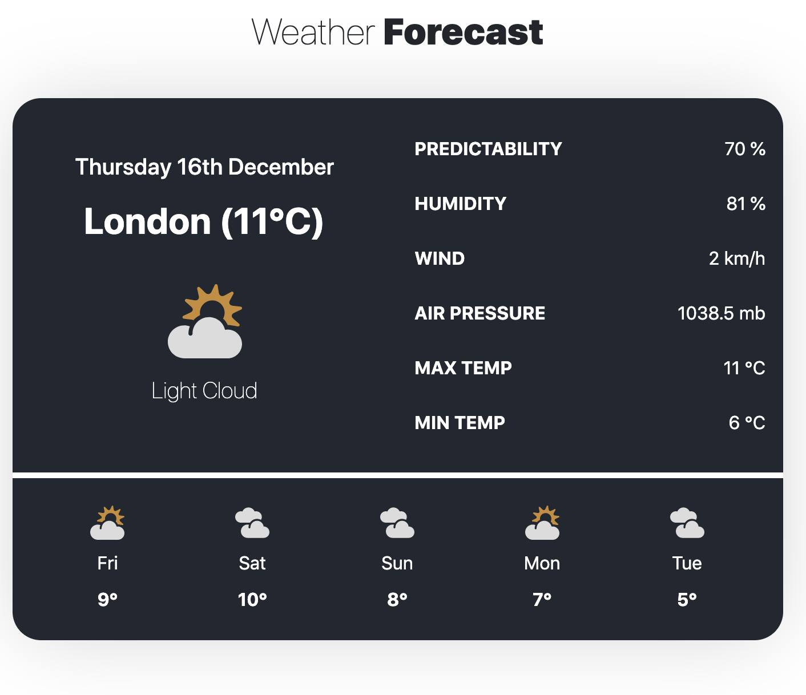

<h1 align="center"> React Weather Application </h1>

<p align="center">  
A web application that uses the MetaWeather API to gather and display weather related information for a location that is entered by a user. Displays current day max & min temp, humidity, predictability as well as the predicted weather the next 5 days in that same location. 
</p>

<div>
  
</div>

### Built with

- HTML5, CSS, JAVASCRIPT
- [React](https://reactjs.org/) - JS library
- MetaWeather API
- ASYNC/AWAIT
- AXIOS
- MOMENTJS

### What I learned

This was the first project I've built that consumes an external API so I got to grips with a lot of new concepts as a result. I used the library Axios to get support for requests/responses and the conversion of data into JSON format. Axios is also promise-based which allowed me to make good use of async and await for more readable asynchronous code.

```js
    const getWoeid = async (location) => {
            const {data} = await axios(`${REQUEST_URL}/search`, { params: { query: location }});
```

I also got to make good use of the special propTypes property to make sure the data that I am recieving is valid. I was able to check the type of particular responses and when an invalid value was provided for a prop, a warning was shown in the JavaScript console will helped with debugging the application.

```js
CurrentDay.propTypes = {
  date: PropTypes.string.isRequired,
  location: PropTypes.string.isRequired,
  temperature: PropTypes.number.isRequired,
};
```

### Potential Future Features

Using local storage I could make a way for the user to select and favourite different locations so that when the user first opens up the app, he is met with the weather for those selected locations. Then if the user wishes to find out the weather for a different location they can do so as opposed to forcing them to input a location everytime they run the app.

## Get started

From your command line, first clone this repo:

```bash
# Clone this repository
$ git clone https://github.com/tagabaza/reading-list-app

# Go into the repository
$ cd reading-list-app

# Remove current origin repository
$ git remote remove origin
```

Then you can install the dependencies using NPM:

Using NPM:

```bash
# Install dependencies
$ npm install
```
